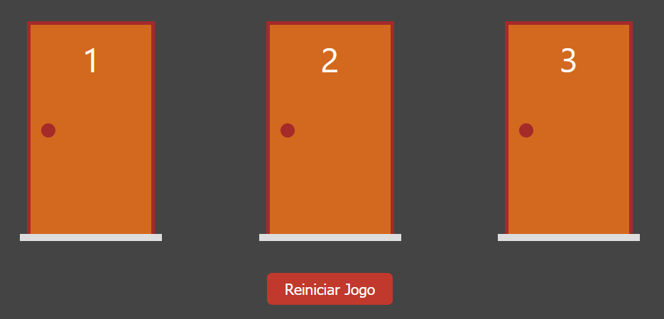

<div align="center">
  <h1>Monty Hall</h1>
  <p>React Web Application of the
    <a href="https://en.wikipedia.org/wiki/Monty_Hall_problem" target="_blank">
      Monty Hall Problem
    </a>
  </p>
  
</div>

## Executando

Na pasta raiz do projeto, execute os seguintes comandos

```bash
# Instale as dependências
yarn

# rode aplicação em modo de desenvolvimento
yarn dev
```

### Créditos

Feito no Curso da [Cod3r](cod3r_next) de React e Next.js

[monty_hall]: https://en.wikipedia.org/wiki/Monty_Hall_problem
[cod3r_next]: https://www.cod3r.com.br/courses/nextjs
